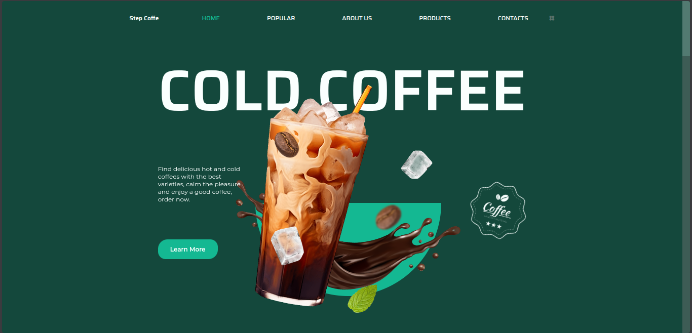
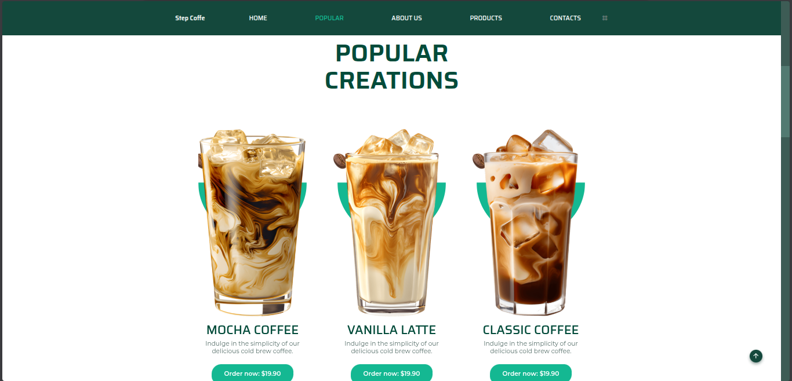
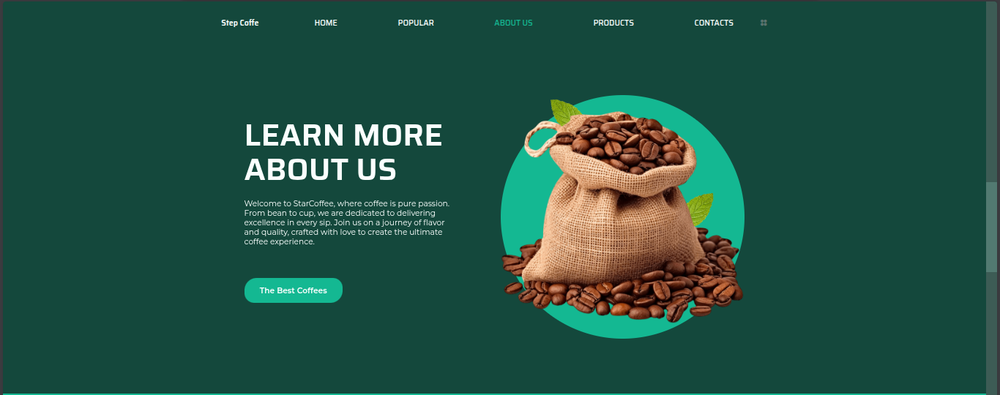
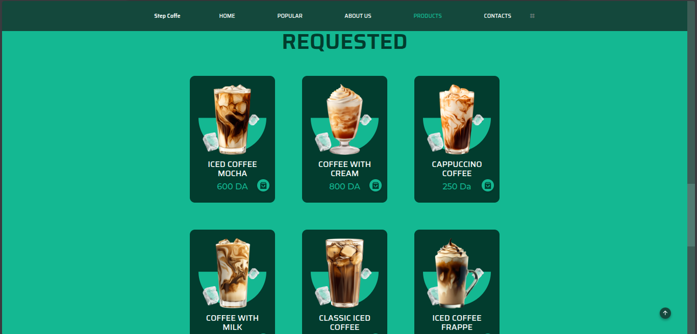
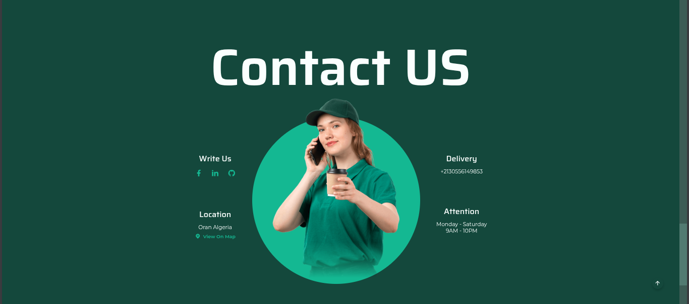

# ☕ Coffee Shop - Landing Page

A sleek and modern coffee shop landing page built using HTML, CSS, and JavaScript. The design is fully responsive and features a product showcase, brand story, and stylish visual elements.

## 🔍 Overview

This project is a front-end template for a coffee shop website. It is designed to present essential information, highlight featured drinks, and attract users through appealing visuals and responsive layout.

### Objectives:
- Introduce a coffee shop through a professional web interface.
- Display a categorized list of products.
- Highlight the brand’s identity and aesthetic appeal.

## 🛠️ Technologies Used

- **HTML5** – For the semantic structure of the page  
- **CSS3** – For styling and layout  
- **Vanilla JavaScript** – For basic interactivity  
- **Responsive Design** – Ensures compatibility across devices

## 🎯 Key Features

- Clean and modern layout  
- Responsive on desktop, tablet, and mobile  
- Image-based product presentation  
- Smooth animations and transitions  
- Easy navigation experience

## 🔗 Live Preview

[👉 View Project Live](https://youssefbelhadadji.github.io/Coffee/)

## 📸 Screenshots







## 🚀 Installation

Clone the repository and open the `index.html` file in your browser:

```bash
git clone https://github.com/YoussefBelhadadji/Coffee.git
cd Coffee
open index.html
